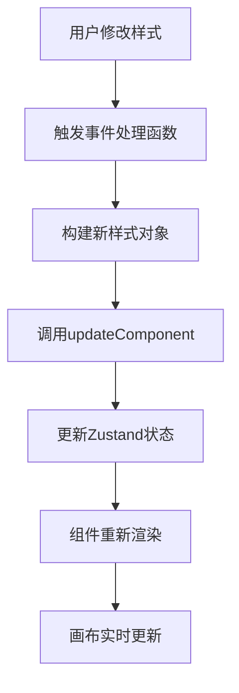

# 低代码编辑器组件外观修改指南

## 📋 概述

本文档详细介绍了如何在低代码编辑器中修改组件的外观样式，包括样式配置面板的使用方法、技术实现原理以及最佳实践。

## 🎯 功能概览

### 支持的样式修改类型

| 样式类别 | 配置项 | 控件类型 | 实现效果 |
|---------|-------|---------|---------|
| 📏 **尺寸** | 宽度/高度 | Input + 单位选择 | 支持px、%、vw、vh、em、rem |
| 🎨 **外观** | 背景色 | ColorPicker | 实时颜色选择器 |
| 🔲 **形状** | 圆角 | InputNumber | 自动添加px单位 |
| 📦 **间距** | 边距 | 四边输入框 | 支持统一或分别设置 |
| 🔤 **字体** | 字体设置 | 多种控件 | 大小/族/重量/对齐 |
| ✨ **特效** | 阴影/透明度 | Switch/Slider | 预设效果和自定义 |
| 🔳 **边框** | 边框样式 | 综合控件 | 颜色/粗细/样式 |

## 🚀 快速开始

### 1. 选择组件
首先在画布中点击要修改外观的组件，选中后会出现蓝色选中框。

### 2. 打开样式面板
在右侧属性面板中，点击"外观"选项卡进入样式配置界面。

### 3. 修改样式属性
根据需要调整各种样式属性，修改会实时应用到画布中的组件。

## 🎨 详细功能介绍

### 📏 尺寸设置

#### 宽度和高度配置
```
输入框 + 单位选择器
┌─────────────┬─────┐
│    100      │ px  │  ← 数值输入
└─────────────┴─────┘
                 ↑
            单位选择（px/%/vw/vh/em/rem）
```

**使用方法：**
1. 在数值框中输入尺寸数值
2. 在下拉框中选择合适的单位
3. 修改会立即应用到组件

**支持的单位：**
- **px**: 像素，绝对单位
- **%**: 百分比，相对于父容器
- **vw**: 视窗宽度百分比
- **vh**: 视窗高度百分比
- **em**: 相对于字体大小
- **rem**: 相对于根元素字体大小

### 🎨 外观样式

#### 背景色设置
使用Ant Design的ColorPicker组件：
- 支持拾色器选择
- 支持十六进制颜色输入
- 支持RGB/HSL格式
- 实时预览效果

#### 圆角设置
```
圆角 [  8  ] px
```
- 输入数值，自动添加px单位
- 范围：0-无限
- 实时圆角效果预览

### 📦 间距管理

#### 边距设置模式
```
□ 统一设置    ← 开关切换

统一模式：
边距 [  16  ] px

分别设置模式：
┌─────┬─────┐
│ 上8 │ 右12│
├─────┼─────┤
│下16 │ 左4 │
└─────┴─────┘
```

**统一设置：** 四边使用相同边距值
**分别设置：** 可以为上、右、下、左分别设置不同的边距值

### 🔤 字体样式

#### 字体大小
- 范围：8-72px
- 使用InputNumber控件
- 自动添加px单位

#### 字体族选择
支持的字体：
- Arial, sans-serif
- Helvetica, sans-serif
- Times New Roman, serif
- Georgia, serif
- Microsoft YaHei, sans-serif（中文）
- SimSun, serif（宋体）
- monospace（等宽字体）

#### 字重配置
- 细体（300）
- 正常（400）
- 中等（500）
- 粗体（600）
- 特粗（700）

#### 文字对齐
```
┌───┬───┬───┐
│ ← │ ↑ │ → │  ← 左对齐/居中/右对齐
└───┴───┴───┘
```
使用按钮组选择，支持左对齐、居中、右对齐三种模式。

### ✨ 特效设置

#### 阴影效果
```
阴影 [开关] 0 2px 8px rgba(0,0,0,0.15)
```
- 开关控制阴影显示/隐藏
- 开启时使用预设阴影效果
- 关闭时移除所有阴影

#### 透明度控制
```
透明度 ────○────
         0   0.5   1
```
- 使用滑块控制
- 范围：0-1
- 步长：0.1
- 实时预览透明度变化

### 🔳 边框配置

#### 边框颜色
使用ColorPicker选择边框颜色，支持完整的颜色选择功能。

#### 边框粗细
- 范围：0-20px
- 使用InputNumber控件
- 0表示无边框

#### 边框样式
- **实线（solid）**：连续的实线边框
- **虚线（dashed）**：虚线边框
- **点线（dotted）**：点状边框
- **双线（double）**：双层边框
- **无边框（none）**：移除边框

## 🔧 技术实现原理

### 状态管理架构

```
ComponentStyle组件
├── useComponentsStore (获取当前组件)
├── updateComponent (更新组件样式)
└── useShallow (性能优化)
```

### 样式更新流程



### 核心代码示例

#### 样式更新函数
```typescript
const updateStyle = useCallback((newStyle: Record<string, any>) => {
    if (!curComponent) {
        message.warning('请先选择一个组件');
        return;
    }
    
    const currentProps = curComponent.props || {};
    const currentStyle = currentProps.style || {};
    
    const updatedProps = {
        ...currentProps,
        style: {
            ...currentStyle,
            ...newStyle
        }
    };
    
    updateComponent(curComponent.id, updatedProps);
    message.success('样式已更新');
}, [curComponent, updateComponent]);
```

#### 尺寸处理
```typescript
const handleWidthChange = useCallback((value: string, unit: string) => {
    const sizeValue = generateSizeValue(value, unit);
    updateStyle({ width: sizeValue });
}, [generateSizeValue, updateStyle]);
```

#### 颜色处理
```typescript
const handleBackgroundColorChange = useCallback((color: Color) => {
    updateStyle({ backgroundColor: color.toHexString() });
}, [updateStyle]);
```

## 💡 最佳实践

### 1. 样式命名规范
- 使用语义化的样式名称
- 保持样式的一致性
- 避免使用过于具体的数值

### 2. 性能优化
- 使用useCallback缓存事件处理函数
- 使用防抖避免频繁更新
- 智能状态更新检测

### 3. 用户体验
- 提供实时预览
- 友好的错误提示
- 合理的默认值设置

### 4. 响应式设计
- 考虑不同屏幕尺寸
- 使用相对单位（%、vw、vh）
- 测试多种设备适配

## 🎯 使用技巧

### 快速样式应用
1. **批量修改**：选中组件后，可以连续修改多个样式属性
2. **样式复制**：通过复制组件实现样式复用
3. **预设模板**：为常用样式组合创建模板

### 常用样式组合

#### 卡片样式
```css
background-color: #ffffff
border-radius: 8px
box-shadow: 0 2px 8px rgba(0,0,0,0.15)
padding: 16px
```

#### 按钮样式
```css
background-color: #1890ff
color: #ffffff
border-radius: 4px
padding: 8px 16px
font-weight: 500
```

#### 标题样式
```css
font-size: 24px
font-weight: 600
color: #1f2937
margin-bottom: 16px
```

## 🐛 常见问题

### Q: 样式修改后没有生效？
**A:** 检查以下几点：
1. 确保已选中目标组件
2. 检查样式值是否合法
3. 确认组件支持该样式属性
4. 刷新页面重试

### Q: 颜色选择器无法显示？
**A:** 可能的原因：
1. Ant Design版本兼容性问题
2. 浏览器权限限制
3. 尝试手动输入颜色值

### Q: 单位切换后数值错乱？
**A:** 这是正常现象：
1. 不同单位有不同的数值范围
2. 建议重新输入合适的数值
3. 参考单位换算关系

### Q: 边距设置不生效？
**A:** 检查以下设置：
1. 确认是否选择了正确的边距模式
2. 检查父容器是否有样式冲突
3. 确认输入的数值范围合理

## 🔮 未来功能规划

### 即将支持的功能
1. **样式模板**：预设样式模板库
2. **批量操作**：多组件同时修改样式
3. **样式继承**：子组件继承父组件样式
4. **动画效果**：过渡动画和关键帧动画
5. **响应式断点**：不同屏幕尺寸的样式适配
6. **CSS变量**：支持CSS自定义属性
7. **样式导入导出**：样式配置的保存和加载

### 高级功能
1. **实时协作**：多用户同时编辑样式
2. **版本控制**：样式修改历史记录
3. **自动优化**：样式代码自动优化建议
4. **设计系统**：与设计规范集成

## 📚 相关资源

### 技术文档
- [Ant Design ColorPicker](https://ant.design/components/color-picker)
- [CSS单位参考](https://developer.mozilla.org/en-US/docs/Web/CSS/length)
- [Flexbox指南](https://css-tricks.com/snippets/css/a-guide-to-flexbox/)

### 设计资源
- [Material Design](https://material.io/design)
- [Ant Design 设计语言](https://ant.design/docs/spec/introduce)
- [CSS Grid指南](https://css-tricks.com/snippets/css/complete-guide-grid/)

## 📝 总结

ComponentStyle组件提供了完整的可视化样式编辑功能，支持：

✅ **实时预览** - 所见即所得的编辑体验  
✅ **丰富控件** - 多种专业样式控件  
✅ **性能优化** - 高效的状态管理和更新机制  
✅ **用户友好** - 直观的操作界面和友好提示  
✅ **扩展性强** - 易于添加新的样式配置项  

通过这个样式配置面板，用户可以轻松地自定义组件外观，创建出符合需求的界面设计。系统采用了现代化的技术栈和最佳实践，确保了功能的稳定性和可维护性。

---

*本文档版本：v1.0 | 最后更新：2024年*